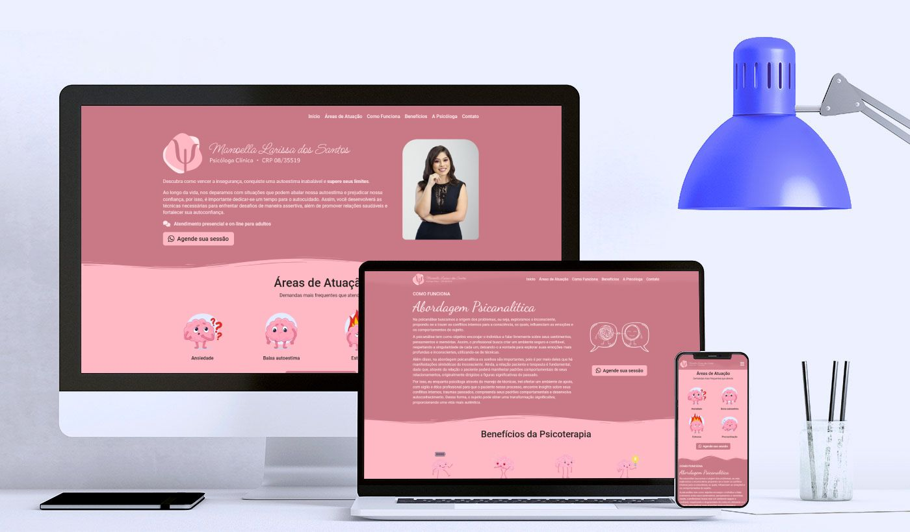

# Site da Psicóloga Manoella Larissa

Este projeto é um site desenvolvido para a psicóloga Manoella Larissa, utilizando Angular com geração de site estático (SSG - Static Site Generation) e publicado no GitHub Pages.



## Tecnologias Utilizadas

- **Angular**: Framework de desenvolvimento web utilizado para construir a interface do usuário.
- **GitHub Pages**: Serviço de hospedagem utilizado para publicar o site.
- **Microsoft Clarity**: Ferramenta de análise de comportamento do usuário que fornece visões detalhadas sobre a interação dos visitantes com o site. 

## Sessões

- **Início**: Sessão inicial com uma visão geral sobre a psicóloga e os serviços oferecidos.
- **Áreas de Atuação**: Descrição das diferentes áreas de atuação da psicóloga.
- **Como Funciona**: Explicação sobre como funcionam as sessões de terapia, o processo e a abordagem utilizada.
- **Benefícios**: Informações sobre os benefícios de fazer terapia e como ela pode ajudar.
- **A Psicóloga**: Sessão com informações detalhadas sobre a formação e experiência profissional da psicóloga.
- **Contato**: Dados de contato e endereço da psicóloga.

## Como Rodar o Projeto Localmente

- **Clone o repositório**:

```sh
  git clone https://github.com/leonardomnds/manoellalarissa.git
  cd manoellalarissa
```

- **Instale as dependências**:

```sh
  npm install
```

- **Rodar o servidor de desenvolvimento**:

```sh
  npm run serve
```

- **Acesse o site**:

  Abra o navegador e vá para [http://localhost:4200](http://localhost:4200).

## Como Gerar o Site Estático

```sh
  npm run build
```

## Publicação no GitHub Pages

- **Instale o pacote `angular-cli-ghpages`**:

```sh
  npm install -g angular-cli-ghpages
```

- **Faça o deploy para o GitHub Pages**:

```sh
  npm run deploy
```

- **Acesse o site**:

  Abra o navegador e vá para [https://www.manoellalarissa.com.br](https://www.manoellalarissa.com.br).

## Microsoft Clarity

Este projeto utiliza **Microsoft Clarity** para obter visões detalhadas sobre como os visitantes interagem com o site. Clarity oferece funcionalidades como:

- **Mapas de calor**: Visualização das áreas mais clicadas e visualizadas pelos usuários.
- **Sessões gravadas**: Gravações das sessões dos usuários para entender melhor seus comportamentos e dificuldades.
- **Análise detalhada**: Dados sobre a interação dos usuários, ajudando a identificar oportunidades de melhoria na experiência do usuário.

Para integrar o Microsoft Clarity ao projeto, siga os passos descritos na [documentação oficial](https://clarity.microsoft.com/).

## Licença

Este projeto está licenciado sob a licença MIT. Veja o arquivo [LICENSE](LICENSE) para mais detalhes.

---

Espero que este site seja útil e proporcione uma ótima experiência aos visitantes e clientes da psicóloga Manoella Larissa. Se tiver qualquer dúvida ou sugestão, sinta-se à vontade para entrar em contato!
